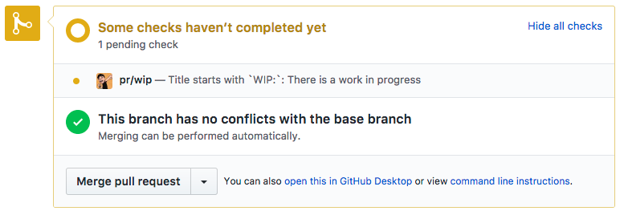
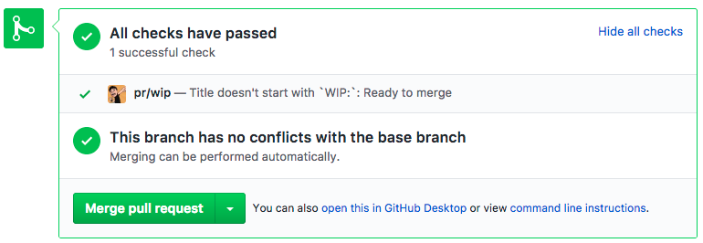

# WIP Pull Requests in GitHub 

Just start your PR title with `WIP:` and you'll get a pending status

Remove the `WIP:` and you'll get a success status

this is all

## Usage
- clone
- deploy to Heroku 
- set `GITHUB_TOKEN` to your personal (or bot) github access token
- set a webhook for `Pull Requests` only to `https://YOUR_APP.herokuapp.com/event_handler`
